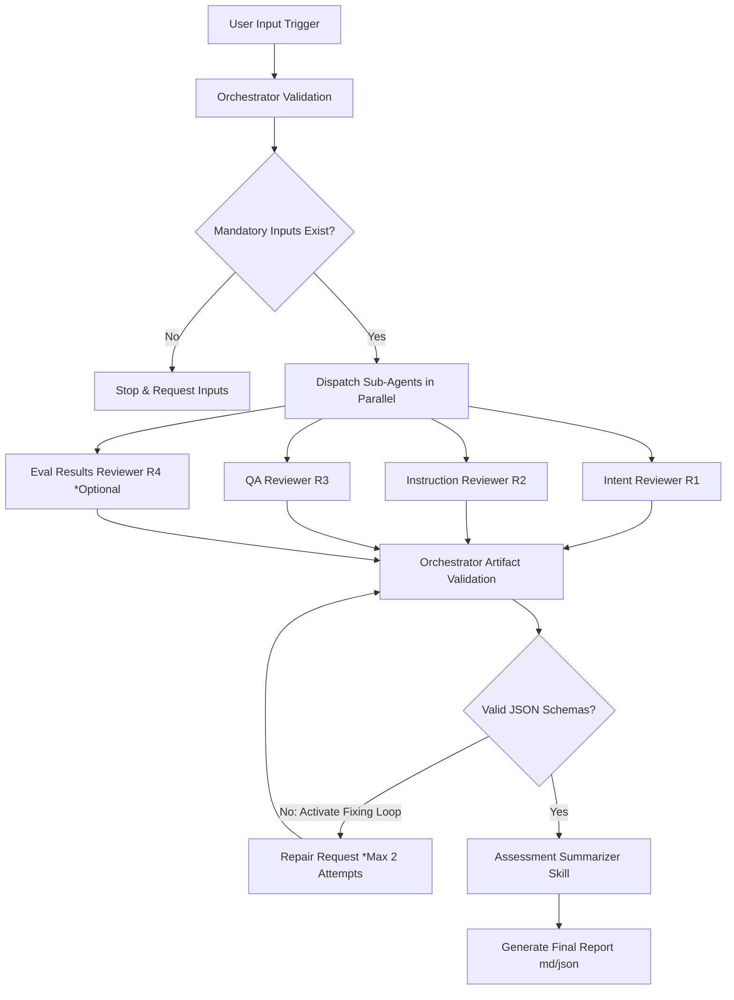
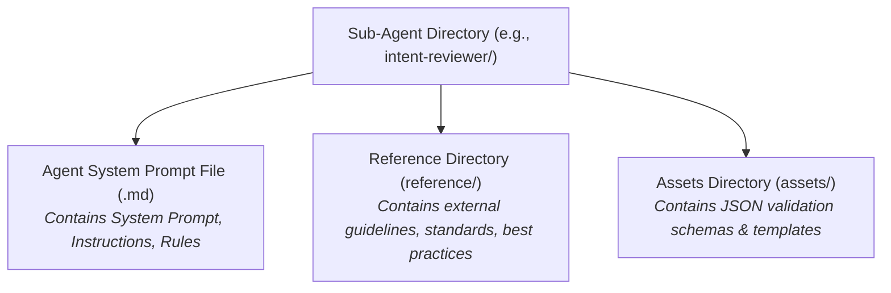
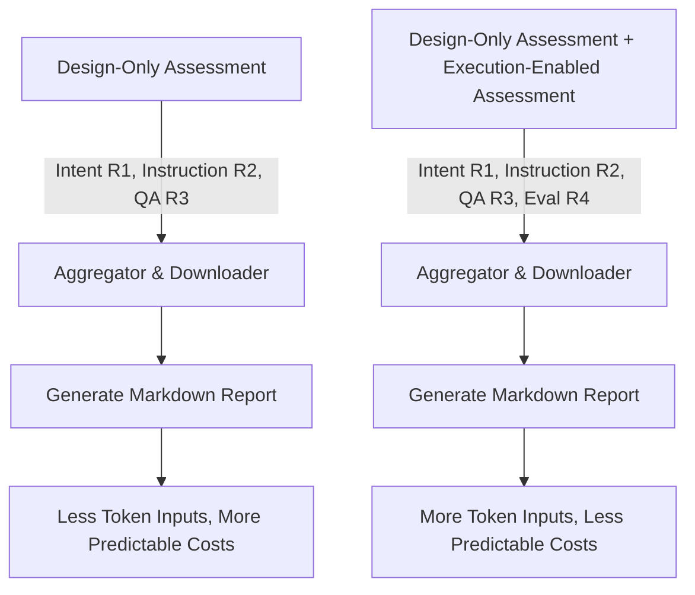

# Skill Quality Assurance Framework (SQAF)
[](#)[](#)[](#)[](#)[](#)[](#)[](#)[](#)[](#)[](#)

The **Skill Quality Assurance Framework (SQAF)**, a comprehensive user guidance and operational manual for evaluating the quality, structure, and execution of AI agent skills.

SQAF introduces a systematic, "shift-left" approach to validating AI-native skill artifacts before deploying them to agent libraries (such as Claude Code, Cursor, GitHub Copilot, Windsurf, etc.).

---

## INDEX

| SQAF Topic | Description |
|----------|-------------|
| [The Core Problem & Solution Origin](#the-core-problem--solution-origin) | The market context, the concept of Agent Skills, the framework's core value proposition, stack and benefits, including the iterative improvement loop concept. |
| [Quick Start](#quick-start) | Installation, commands reference an use case reference|  
| [Two Ways to Use SQAF](#two-ways-to-use-sqaf) | How to use SQAF with your IDE and how to use SQAF with the CLI. Usage modes, and agent integration notes for the `sqaf` CLI runner. | |
| [System Prerequisites & LLM Dependency](#system-prerequisites--llm-dependency) | Detail the solution prerequisites,LLM dependencies, agents cli setup, and model-specific environment configurations.|
| [Workflow Overview and Key Features](#workflow-overview-and-key-features) |Solutions components and funcionallities, execution flow|
| [Solution Resource & Token Consumption](#solution-resource--token-consumption) | One of the primary objectives of this solution is to reduce resource consumption by preventing errors in skills; consequently, the solution itself applies this principle by monitoring resource usage during each skill assessment run. This allows users to compare skills and design quality, as higher-quality skills consume fewer resources during the assessment process.| 
| [Solution Validation & Verification Tests](#solution-validation--verification-tests) |The framework contains a total of **122 automated unit and integration tests** and automatic CI pipeline including test and linter for calculator component and the cli interface components.|
| [Contributing](#contributing) | Information about how to contribute to the framework and license details.|    


## Quick link Reference to Project Documentation:

For deeper dives into the architectural definitions and development practices, refer to the following local documents:

| Documents | Description |
|----------|-------------|
| [Problem Origin & Background](docs/problem_origing.md) | The market context, the concept of Agent Skills, and the framework's core value proposition. |
| [Development Guidelines](docs/development_guideline.md) | Strict engineering principles (Isolation, Single Responsibility, Resource Accountability). |
| [Skill Quality Calculator Implementation Plan](docs/calculator_implementation_plan.md) | Scoring formulas, downgrade gates, and the CLI execution structure. |
| [CLI User Guide](docs/cli_user_guide.md) | Installation, commands reference, usage modes, and agent integration notes for the `sqaf` CLI runner. |
| [Test Component Description](docs/test_component_description.md) | A comprehensive explanation of testing strategies, mock behaviors, and environment isolation techniques used in the framework. |

---
## The Core Problem & Solution Origin

### The Problem
Traditionally, AI agent skills are evaluated only at the end-to-end result level:
```txt
Skill ──> Agent ──> Result
```
If the execution fails, it is difficult to determine if the failure was caused by the agent's logic, model hallucinations, or poorly structured/ambiguous instructions within the skill itself. There is no mature discipline to answer:
1. **Design & Maintainability**: Are the skill's instructions clear, or are they ambiguous and prone to degradation?
2. **Robustness**: Does the skill introduce subtle context bloat or hallucination risks?
3. **Consistency**: Does the skill behave reliably under varied context lengths or models?

### The Solution: Shift-Left QA over Skills
SQAF resolves this by introducing an isolated evaluation layer that assesses the *skill itself* separately from the execution agent or the system under test. It was created after a formal **research phase** dedicated to defining the taxonomic classification of QA tasks, prompt design strategies, and evaluator isolation rules. 

The framework is built using industry best practices, drawing inspiration from reference frameworks and guidelines provided by **Anthropic** (the original creator of the open Agent Skills format) and **GitHub** (standards for repository structure, validation, and automation).

**Scope**: SKIIL Assessment on Skills-Base LLM Agents, this means skills systems prompts description **`SKILL.md`**, and skill running results.

**Out of scope**: Skill efficiency in front of business scenarios. Skill RAG and external resorces, such as retrieved documents and knowledge bases, determinist scripts or static templates. 

### Framwork Stack

- Python 3.11+
- Rich (for rich text and UI)
- Pytest (for testing)
- Ruff (for linting)
- Pyfiglet (for ASCII art)

### Framework Benefits:

| Benefit | Description |
|----------|-------------|
| **Shift-Left Quality Assurance** | Detects design issues before execution, reducing costly iteration cycles and improving skill quality early in the development lifecycle. |
| **Defect Prevention** | Identifies ambiguities, inconsistent instructions, missing output contracts, hallucination risks, and insufficient evaluation coverage before deployment. |
| **Deterministic Assessments** | Produces reproducible, evidence-based reviews with identical results for identical inputs, making assessments reliable and consistent. |
| **Specialized Expert Review** | Uses dedicated reviewers for intent, instructions, QA, execution, and aggregation, providing deeper and more explainable assessments than a single general review. |
| **Educational Feedback** | Provides actionable recommendations that help authors develop competencies in instruction engineering, evaluation design, and AI Skill development. |
| **Evaluation Guidance** | Helps improve evaluation suites by identifying missing assertions, weak evals, coverage gaps, and opportunities to strengthen execution benchmarks. |
| **CI/CD Ready** | Produces structured artifacts suitable for automated quality gates, pull request reviews, and continuous integration workflows. |
| **Framework Extensibility** | Modular reviewer architecture allows new quality dimensions to be incorporated without affecting existing components. |
| **Evidence-Based Reporting** | Every finding is supported by explicit evidence, making reviews transparent, traceable, and easier to validate. |
| **Cost Optimization** | Encourages improving Skills from assessment reports instead of repeatedly executing expensive evaluation cycles, reducing token consumption and overall development costs. |

### Iterative Improvement Loop

Rather than executing multiple execution runs of the SQAF assessment, it is highly recommended to establish an **automated improvement loop**:
1. Run the SQAF Orchestrator once to get the final `skill-quality-report.md`.
2. Feed this detailed report directly to a **Refactoring/Improvement Agent**.
3. Let the improvement agent refine the skill instructions and structure based on the concrete, evidence-based recommendations.
4. Run SQAF a second time to verify the improvements.
This approach significantly reduces token consumption and leads to faster, deterministic skill enhancement.

>[Back to Top](#index)
---

## Quick Start

### 1. Clone the repository

```bash
git clone https://github.com/....
cd skill-quality-assurance-framework
```

### 2. Init the assessment of your skills

After you clone and init your IDE environment or by CLI

| Execution Use Case | Description | How to Init it |
|---|---|---|
| From the Cloned Repository|You can use execute the orchestrator within the cloned project workspace and requesting the skill assessment to the AI Agent always must provide the path to the skill| Prompt to the AI Agent and request an skill assessment using the `orchestrator.md` and provide the absolute path to the skill for assessment, e.g.: `/home/user/projects/my-project/skills/my-skill-name/SKILL.md`<br> For more detailed execution workflow see the usage modes| 
| From other workspace |If you are working in other Repository workspace and you need to assess your skills you can use the orchestrator of SQAF without need to change your current directory| Prompt to the AI Agent and request an skill assessment and you must provide the absolute path where is located the orchestrator file, e.g.: `/home/user/projects/skill-quality-assurance-framework/orchestrator.md` and the skill path for assessment, e.g.: `/home/user/projects/my-project/skills/my-skill-name/SKILL.md` |
| Try the solution with the Proof of Concept skills | You can use the dummy skills in the `data-test-poc/` directory to trigger assessments and see how the framework operates. | See the [Data Test PoC README](data-test-poc/README.md) for more details.  |

>[Back to Top](#index)
---
## Two Ways to Use SQAF

SQAF supports two execution surfaces. Both trigger the same orchestrator workflow, only the entry point differs. Both modes produce identical assessment artifacts.

| Mode | How | Best For |
|------|-----|----------|
| **[Usage Mode A: IDE Chat Agent Embedded](#usage-mode-a-ide-chat-agent-embedded)** | Prompt your IDE agent directly in the chat window | Interactive development, first-time use, exploratory assessments |
| **[Usage Mode B: CLI Runner (`sqaf`)](#usage-mode-b-cli-runner-sqaf)** | Run `sqaf` from the terminal | Agentic CLI tools (Claude Code CLI, Codex CLI, Antigravity, Gemini CLI), CI/CD pipelines, scripted workflows |

### Usage Mode A: IDE Chat Agent Embedded

This is the original usage mode. The framework orchestrator runs inside your IDE agent (Claude Code, Antigravity, Cursor, Windsurf, etc.).

1. Open your IDE agent chat window.
2. Point the agent at the `orchestrator.md` file.
3. Trigger the assessment by sending a prompt with the skill path:

```txt
Assess the quality of the following skill: ./skills/my-skill/SKILL.md
```

**NOTE**: The previous instruction will only assess the skill design layer, but if you need to assess the skill's efficiency (after running it), you must create your asertions using an `eval.json` file and then provide to the agent the path to the `eval.json` file.

To include this execution assessment:
```txt
Assess the quality of the following skill: ./skills/my-skill/SKILL.md with evals at ./skills/my-skill/eval.json
```
- The execution assessment is optional depends on `eval.json` file existence. If it is not provided, the evaluation results reviewer will be skipped.
- If you request the execution assessment and the path is omitted, the agent will ask for it and will provides a creation guide automatically (but will not create the `eval.json` file to you).

### Usage Mode B: CLI Runner `sqaf`

This mode was introduced to allow **agentic CLI tools** (Claude Code CLI, Codex CLI, Antigravity, Gemini CLI) and CI/CD pipelines to invoke SQAF programmatically without IDE embedding. For that read the CLI Agents Configurations section in  [CLI User Guide](docs/cli_user_guide.md)

#### Install

```bash
# Recommended: use a virtual environment (for developers and AI practitioners)
python3 -m venv venv
source venv/bin/activate
pip install -e .

# Or install globally
pip install sqaf
```

#### Run CLI Mode
```bash
#Interactive (human-guided)
sqaf

# Pre-fill the skill path, prompt for the rest
sqaf skills/my-skill
sqaf skills/my-skill --eval y

# Fully non-interactive (agents, CI/CD)
sqaf skills/my-skill --eval y --non-interactive
sqaf skills/my-skill --eval n --output reports/ --non-interactive
```
>[Back to Top](#index)

**Strongly recommended**: **DO NOT modify the orchestrator.md file or any other system prompt file in the framework**; doing so may cause the framework to not work as expected.


---

## System Prerequisites & LLM Dependency

**IMPORTANT**

The Skill Quality Assurance Framework is an AI-agent-driven validation system. It **depends on existing LLM preconditions** being set up in the execution environment.
- **Model Access**: The reviewing sub-agents must have access to API keys (e.g., Anthropic Claude, OpenAI GPT, or Google Gemini) configured in your shell environment variables.
- **Agent Client**: The Orchestrator requires an execution client (e.g., Claude Code, Antigravity, or other compatible CLI runner) to be running and authorized.

### Setting Up `sqaf` in Agent CLI Tools

> [!IMPORTANT]
> 
> `sqaf` is a **trigger emitter** — it prints the assessment prompt to stdout. No assessment files are produced unless an active AI agent CLI session reads that output and executes the orchestrator workflow. The agent must be initialized before calling `sqaf`.

### How It Works

```
sqaf (prints trigger) ──stdout──▶ Agent CLI (Claude Code, Antigravity, Gemini CLI)
                                         │
                                         ▼
                               Orchestrator workflow executes
                                         │
                                         ▼
                               skill-quality-report.md produced
```
See more information and recommendations of how setup sqaf in different agent CLI tools at [CLI User Guide](docs/cli_user_guide.md).

>[Back to Top](#index)
---
## Workflow Overview and Key Features

The workflow use as the Key Features the fallowing components:
|Component|Role|
|---|---|
| Orchestrator | Coordinates the entire assessment process.|
| 3 Desing Reviewers Agents (Intent Reviewer, Instruction Reviewer, QA Reviewer)| Assesses each skill independently across three dimensions off design, some like format, context definition, gaps, inconcistencies and ambiguity |
| 1  Evaluators Agent (Eval Results Reviewer)| It works wiyh the concept as *LLM Judge Model* . Assesses the execution results of the skill, include benchmark analysis, timig, grading (asertions rates, success rates, accuracy rates, etc)|
| 1  Assessment Summarizer Skill| It works using deterministic rules to calculate the final quality report |

> **NOTE**: You can prompt in English or other language such as **Spanish**, **this will not affect the quality of the skill assessment** because internal instructions are in English as resource control decision (low tokens consumption), but not as blocking condition.

### Execution Flow

### Sub-Agents Structure

Each reviewer (sub-agent) in the framework is built as an isolated module. 

### Reviewer Isolation Rules
To prevent cognitive bias, context contamination, and false positives/negatives:
1. Reviewers operate completely independently.
2. Reviewers do not inspect other reviewers' assessments.
3. The **Assessment Summarizer** is the *only* component allowed to access all reviewer outputs, functioning strictly as a reporting aggregator without performing additional evaluations.

Below is the directory structure that governs every sub-agent:



### Calculator Feature 
The framework use a **Assessment Summarizer** skill, that includes a standalone, deterministic utility (`skills/assessment-summarizer/scripts/calculator.py`) that aggregates reviewer scores, maps risk values, and applies downgrade gates to generate a final recommendation (`APPROVED`, `APPROVED WITH IMPROVEMENTS`, `REQUIRES REVISION`, or `NOT APPROVED`).

>[Back to Top](#index)
---

## Solution Resource & Token Consumption

**Token usage scales based on the depth of the assessment**:

- **Resource Accountability**: The orchestrator and each sub-agent report their input tokens, output tokens, total tokens, and execution time to help manage API costs.
- **Design-Only Assessment**: Evaluates the skill's structure and instructions. This is highly cost-effective, consuming minimal tokens.
- **Execution-Enabled Assessment** (includes `eval-reviewer`): Consumes a significantly larger volume of input tokens. This is because the execution logs, generated outputs, test suites, and validation evidence must be read and analyzed by the sub-agent.
- **Scope and Windows Context**: A skill that is more complex in terms of design and logic will consume more tokens during the assessment; however, this does not mean that more lines of code automatically equate to higher consumption, as system prompts can be very long without being particularly complex, but keep your skill *under 500 lines of code* to avoid the assessment's context window to be over-consumed.
- **One session by runtime**: To avoid the risk of context contamination or false positives/negatives, it is strongly recommended to assess isolated sessions; this means one skill assessment workflow per session, for new assessment, open a new chat session. This ensures that each skill is assessed in isolation, without interference from other evaluations.

Resource Consumption Diagram


**More Skill Quality Means Less Resource Consumption**

- [x] **Resource Efficiency**  
    - The Skill Quality Assurance Framework (SQAF) is designed to optimize LLM token consumption. By proactively identifying and rectifying skill design flaws, the framework helps reduce errors, re-runs, and inefficient resource usage.
    - **Assessment Summary & Resource Metrics:** Each assessment generates comprehensive resource usage metrics, including input tokens, output tokens, total tokens, and execution time. These metrics enable data-driven decisions to improve skill quality and minimize resource consumption.

- [x] **Cost Optimization for AI-Powered Applications**
    - High-quality skills reduce token usage, directly translating to lower operational costs for AI-powered applications and platforms.

- [x] **Performance Monitoring & Skill Performance Tracking**
    - SQAF provides detailed performance metrics, allowing users to track skill quality improvements over time. This continuous monitoring helps identify trends, measure the effectiveness of remediation efforts, and ensure sustained skill quality.

>[Back to Top](#index)
---
## Solution Validation & Verification Tests

The framework contains a total of **122 automated unit and integration tests** .

The project testing system cover the following components:
- Calculator: score aggregation, risk mapping, downgrade gates, CLI entrypoint
- CLI session: AssessmentSession validity rules and auto-population
- CLI session builder: Interactive and non-interactive session building
- Skills discovery: Workspace scanner and eval artifact detection
- CLI: CLI entrypoint and non-interactive session building
- Orchestrator: Orchestrator workflow execution
- Banner: Banner display and non-interactive session building
- Runner: Runner execution and non-interactive session building
- Renderer: CLI output renderers (PlainRenderer, RichRenderer, and factory)

All framework tests — calculator, CLI session, skill discovery — 
run with a single command from the framework root:

```bash
./venv/bin/python -m pytest tests/ -v
```
For a comprehensive explanation of testing strategies, mock behaviors, and environment isolation techniques, see the [Test Component Description](docs/test_component_description.md) documentation.

### CI Pipeline & Lint Gate

Every push and pull request targeting the `main` branch triggers the **GitHub Actions CI workflow** (`.github/workflows/ci.yml`).The linting step uses `ruff`, a fast, zero-config Python linter that enforces PEP 8, import ordering, and common style rules. It runs **before** the test suite so that style violations are caught early without consuming testing execution time.
The pipeline enforces code quality automatically before tests are allowed to run. See details in [Test Component Description](docs/test_component_description.md#ci-pipeline).

>[Back to Top](#index)
---

## Contributing

SQAF is an evolving open-source project, and community contributions are highly appreciated.
Whether you've found a bug, identified an improvement, or want to propose a new feature, feel free to open an Issue or submit a Pull Request.
Please read the [Contribution & Governance Guide](GOVERNANCE_CONTRIBUTING.md) before contributing to understand the project's workflow, contribution guidelines, and governance model.
Every contribution—large or small—helps make SQAF a more robust and reliable framework for AI Skill quality assurance.

License
Copyright 2026 Leticia Perez Gainza. Licensed under the Apache License 2.0.

See [LICENSE](LICENSE) for details.

>[Back to Top](#index)