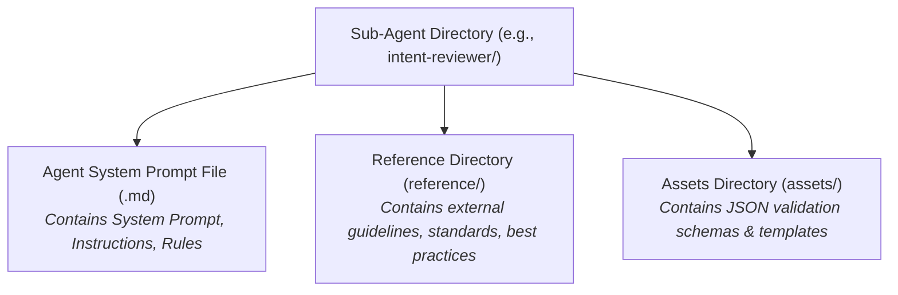
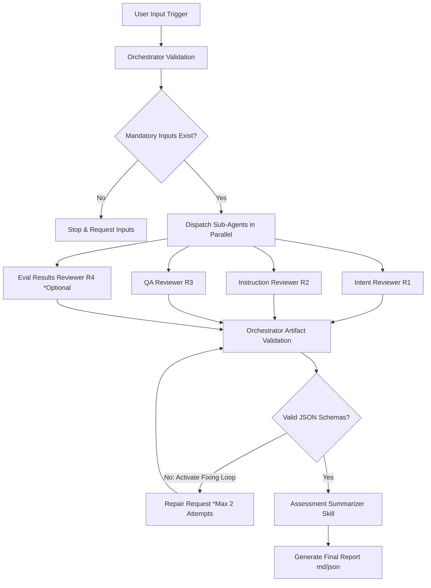
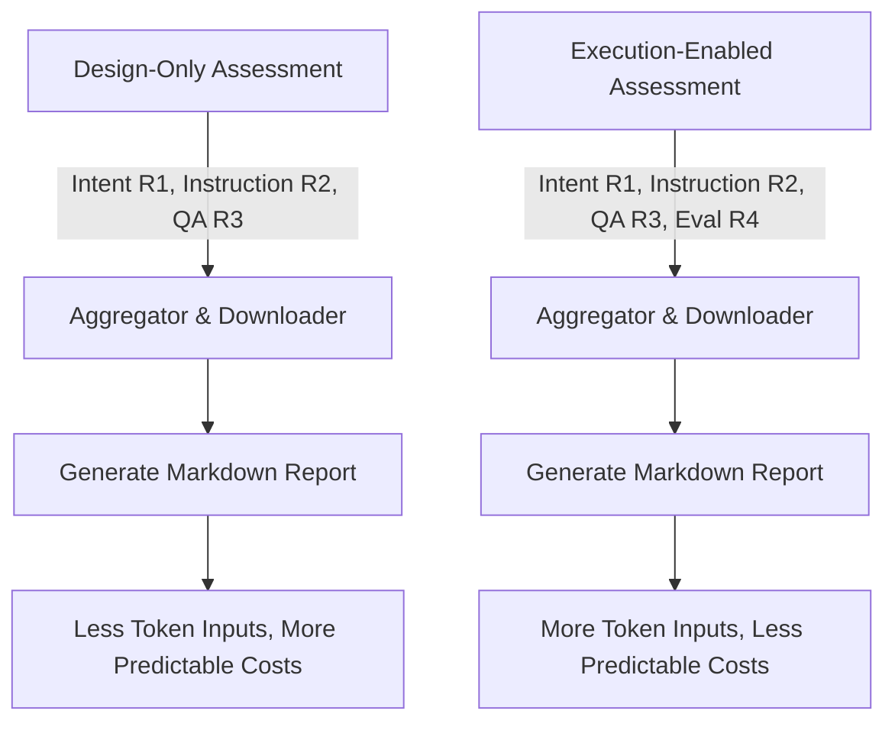

# Skill Quality Assurance Framework (SQAF)

The **Skill Quality Assurance Framework (SQAF)**, a comprehensive user guidance and operational manual for evaluating the quality, structure, and execution of AI agent skills.

SQAF introduces a systematic, "shift-left" approach to validating AI-native skill artifacts before deploying them to agent libraries (such as Claude Code, Cursor, GitHub Copilot, Windsurf, etc.).

---

## Links to Framework Documentation
For deeper dives into the architectural definitions and development practices, refer to the following local documents:
- [Problem Origin & Background](docs/problem_origing.md) — The market context, the concept of Agent Skills, and the framework's core value proposition.
- [Development Guidelines](docs/development_guideline.md) — Strict engineering principles (Isolation, Single Responsibility, Resource Accountability).
- [Skill Quality Calculator Implementation Plan](docs/calculator_implementation_plan.md) — Scoring formulas, downgrade gates, and the CLI execution structure.
- [CLI User Guide](docs/cli_user_guide.md) — Installation, commands reference, usage modes, and agent integration notes for the `sqaf` CLI runner.

---

## The Core Problem & Solution Origin
### The Problem
Traditionally, AI agent skills are evaluated only at the end-to-end result level:
```txt
Skill ──> Agent ──> Result
```
If the execution fails, it is difficult to determine if the failure was caused by the agent's logic, model hallucinations, or poorly structured/ambiguous instructions within the skill itself. There is no mature discipline to answer:
1. **Design & Maintainability**: Are the skill's instructions clear, or are they ambiguous and prone to degradation?
2. **Robustness**: Does the skill introduce subtle context bloat or hallucination risks?
3. **Consistency**: Does the skill behave reliably under varied context lengths or models?

### The Solution: Shift-Left QA over Skills
SQAF resolves this by introducing an isolated evaluation layer that assesses the *skill itself* separately from the execution agent or the system under test. It was created after a formal **research phase** dedicated to defining the taxonomic classification of QA tasks, prompt design strategies, and evaluator isolation rules. 

The framework is built using industry best practices, drawing inspiration from reference frameworks and guidelines provided by **Anthropic** [the original creator of the open Agent Skills format] and **GitHub** (standards for repository structure, validation, and automation).

---

## System Prerequisites & LLM Dependency
> [!IMPORTANT]
> The Skill Quality Assurance Framework is an AI-agent-driven validation system. It **depends on existing LLM preconditions** being set up in the execution environment.
- **Model Access**: The reviewing sub-agents must have access to API keys (e.g., Anthropic Claude, OpenAI GPT, or Google Gemini) configured in your shell environment variables.
- **Agent Client**: The Orchestrator requires an execution client (e.g., Claude Code, Antigravity, or other compatible CLI runner) to be running and authorized.

---

## Sub-Agent Structure
Each reviewer (sub-agent) in the framework is built as an isolated module. Below is the directory structure that governs every sub-agent:



### Reviewer Isolation Rules
To prevent cognitive bias, context contamination, and false positives/negatives:
1. Reviewers operate completely independently.
2. Reviewers do not inspect other reviewers' assessments.
3. The **Assessment Summarizer** is the *only* component allowed to access all reviewer outputs, functioning strictly as a reporting aggregator without performing additional evaluations.

---

## Input Flow & Activation Workflow
The **Lead QA Orchestrator** coordinates the entire assessment process. To trigger the orchestrator, you must provide the complete path to the target skill.

### 1. Trigger Command
The input prompt sent to the Orchestrator must contain the path to the skill directory containing the `SKILL.md` file:
```txt
Assess the quality of the following skill: ./skills/my-skill/SKILL.md
```
To include execution testing, supply the optional `eval.json` path:
```txt
Assess the quality of the following skill: ./skills/my-skill/SKILL.md with evals at ./skills/my-skill/eval.json
```

### 2. Execution Flow


---

## Resource & Token Consumption

Token usage scales based on the depth of the assessment:

- **Resource Accountability**: The orchestrator and each sub-agent report their input tokens, output tokens, total tokens, and execution time to help manage API costs.
- **Design-Only Assessment**: Evaluates the skill's structure and instructions. This is highly cost-effective, consuming minimal tokens.
- **Execution-Enabled Assessment** (includes `eval-reviewer`): Consumes a significantly larger volume of input tokens. This is because the execution logs, generated outputs, test suites, and validation evidence must be read and analyzed by the sub-agent.

Resource Consumption Diagram


---

## Two Ways to Use SQAF

SQAF supports two execution surfaces. Both trigger the same orchestrator workflow — only the entry point differs.

| Mode | How | Best For |
|------|-----|----------|
| **IDE Chat (Agent Embedded)** | Prompt your IDE agent directly in the chat window | Interactive development, first-time use, exploratory assessments |
| **CLI Runner (`sqaf`)** | Run `sqaf` from the terminal | Agentic CLI tools (Claude Code CLI, Codex CLI, Antigravity, Gemini CLI), CI/CD pipelines, scripted workflows |

Both modes produce identical assessment artifacts.
## Quick Start

### 1. Clone the repository

```bash
git clone https://github.com/....
cd skill-quality-assurance-framework
```

---

### Usage Mode A — IDE Chat (Agent Embedded)

This is the original usage mode. The framework orchestrator runs inside your IDE agent (Claude Code, Antigravity, Cursor, Windsurf, etc.).

1. Open your IDE agent chat window.
2. Point the agent at the `orchestrator.md` file.
3. Trigger the assessment by sending a prompt with the skill path:

```txt
Assess the quality of the following skill: ./skills/my-skill/SKILL.md
```

To include execution testing:

```txt
Assess the quality of the following skill: ./skills/my-skill/SKILL.md with evals at ./skills/my-skill/eval.json
```

- If the path is omitted, the agent will ask for it.
- If no `eval.json` exists, the framework provides a creation guide automatically.

---

### Usage Mode B — CLI Runner (`sqaf`)

This mode was introduced to allow **agentic CLI tools** (Claude Code CLI, Codex CLI, Antigravity, Gemini CLI) and CI/CD pipelines to invoke SQAF programmatically without IDE embedding.

#### Install

```bash
# Recommended: use a virtual environment (for developers and AI practitioners)
python -m venv venv
source venv/bin/activate
pip install -e .

# Or install globally
pip install sqaf
```

#### Run — Interactive (human-guided, auto-discovers skills)

```bash
sqaf
```

#### Run — Pre-fill the skill path, prompt for the rest

```bash
sqaf skills/my-skill
sqaf skills/my-skill --eval y
```

#### Run — Fully non-interactive (agents, CI/CD)

```bash
sqaf skills/my-skill --eval y --non-interactive
sqaf skills/my-skill --eval n --output reports/ --non-interactive
```

#### Run the CLI test suite

```bash
./venv/bin/python -m pytest tests/ -v
```

> See [CLI User Guide](docs/cli_user_guide.md) for the full commands reference, rendering behavior, and agent integration details.

---

## Setting Up `sqaf` in Agent CLI Tools

> [!IMPORTANT]
> `sqaf` is a **trigger emitter** — it prints the assessment prompt to stdout. No assessment files are produced unless an active AI agent CLI session reads that output and executes the orchestrator workflow. The agent must be initialized before calling `sqaf`.

### How It Works

```
sqaf (prints trigger) ──stdout──▶ Agent CLI (Claude Code, Antigravity, Gemini CLI)
                                         │
                                         ▼
                               Orchestrator workflow executes
                                         │
                                         ▼
                               skill-quality-report.md produced
```
See more information and recommendations of how setup sqaf in different agent CLI tools at [CLI User Guide](docs/cli_user_guide.md).

---

## Calculator Feature & Verification Tests
The framework includes a standalone, deterministic utility (`skills/assessment-summarizer/scripts/calculator.py`) that aggregates reviewer scores, maps risk values, and applies downgrade gates to generate a final recommendation (`APPROVED`, `APPROVED WITH IMPROVEMENTS`, `REQUIRES REVISION`, or `NOT APPROVED`).

### Running All Tests

All framework tests — calculator, CLI session, skill discovery — run with a single command from the framework root:

```bash
./venv/bin/python -m pytest tests/ -v
```

| Test File | Coverage |
|-----------|----------|
| `test_calculator.py` | Score aggregation, risk mapping, downgrade gates, CLI entrypoint |
| `test_session.py` | `AssessmentSession` validity rules and auto-population |
| `test_session_builder.py` | Interactive and non-interactive session building |
| `test_skills_discovery.py` | Workspace scanner and eval artifact detection |

To run only calculator tests:

```bash
./venv/bin/python -m pytest tests/test_calculator.py -v
```

---

## Recommendation: Iterative Improvement Loop
Rather than executing multiple execution runs of the SQAF assessment, it is highly recommended to establish an **automated improvement loop**:
1. Run the SQAF Orchestrator once to get the final `skill-quality-report.md`.
2. Feed this detailed report directly to a **Refactoring/Improvement Agent**.
3. Let the improvement agent refine the skill instructions and structure based on the concrete, evidence-based recommendations.
4. Run SQAF a second time to verify the improvements.
This approach significantly reduces token consumption and leads to faster, deterministic skill enhancement.
