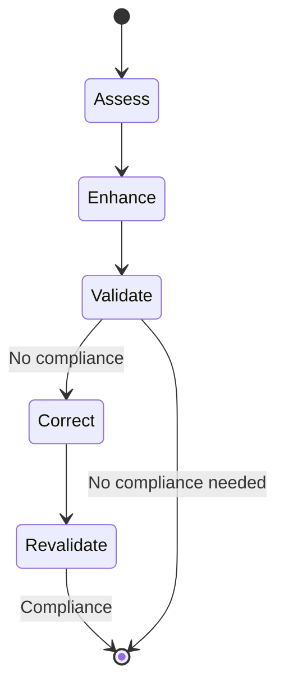

# Skill Quality Assurance Framework

## Development Guidelines

### Purpose

This document establishes the engineering principles that govern the implementation of the **Skill Quality Assurance Framework (SQAF)**.

The framework must remain deterministic, modular, extensible, and aligned with the Agent Skills specification while focusing on quality assurance for AI-native skills.

---

# Core Design Principles

## 1. Single Responsibility

Each component must perform exactly one responsibility.

Examples:

* `Orchestrator` → coordinates workflow.
* `Intent Reviewer` → evaluates intent and format only (e.g., does the skill description match the skill's functionality?)
* `Instruction Reviewer` → evaluates the clarity, completeness, and testability of the skill's instructions.
* `QA Reviewer` → evaluates context efficiency only (how the skill uses context, hallucination prevention, output contract, and evaluation methodology).
* `Assessment Aggregator` → Skill that aggregates assessments only.

Reviewers must never perform another reviewer's responsibility.

### Designs Decision

#### Orchestrator

- Include rules for the entire workflow
- Harness all the features of the framework
- Use prompt engineering strategies to improve instruction fidelity and reduce the likelihood that critical framework rules are overlooked during execution.

>Reinforcement Through Instruction Redundancy
>
>The `Orchestrator`'s system prompt intentionally distributes critical rules throughout multiple sections of the prompt. Instead of repeating identical sentences, equivalent constraints are expressed using different wording while preserving the same semantic intent and consistently reinforcing key concepts.
>
>This design follows a prompt engineering strategy that increases the prominence of high-priority constraints during reasoning.
>The objective is to improve instruction fidelity and reduce the likelihood that critical framework rules are overlooked during execution.

#### Reviewers

- Each reviewer must be self-contained and deterministic.
- Each reviewer must not know about the existence of other reviewers or their results.
- Apply its on reasoning parameters and use its specifics knowledge/reference material to produce the assessment, this keeps the context focused to the minimum.
- The reviewer can use its specific knowledge only if it improves the quality of the assessment. 
- The reviewer should not use external knowledge/reference material unless it is explicitly provided by the user.

---

## 2. Reviewer Isolation

Every reviewer operates independently.
|A reviewer Responsabillity | Reviewers Restrictions|
|---------------------------|---------------------|
|- receives only its assigned inputs - evaluates only its assigned concern - produces only its own assessment.|- inspect another reviewer's assessment - modify another assessment - aggregate results - infer information outside their assigned scope.|

---

## 3. Progressive Context Loading

- The framework should minimize context consumption.
- Each reviewer receives only the information required to complete its assessment.
- Supporting references should only be provided when explicitly required.
- Large reference material should remain external to the System Prompt.

---

## 4. Deterministic Assessments

Given identical inputs, reviewers should produce logically equivalent assessments.

Reviewers must avoid:

* subjective opinions;
* speculative reasoning;
* inconsistent scoring.

Assessment results must be evidence-driven.

---

## 5. Evidence-Based Evaluation

Every finding must be supported by observable evidence.

Evidence may originate from:

* skill files;
* generated outputs;
* evaluation artifacts;
* reference documentation provided by the user.

Reviewers must never invent evidence.

---

## 6. Controlled Scope

The framework evaluates the quality of a skill.

The framework does not evaluate:

* business value;
* organizational suitability;
* implementation priorities;
* product strategy;
* user decisions.

These remain the responsibility of the user.

---

## 7. Validation Before Assessment

Every reviewer validates its mandatory inputs before beginning an assessment.

If required inputs are missing:

* stop the assessment;
* report missing prerequisites;
* do not generate partial findings.

---

## 8. Standardized Assessment Artifacts

- All reviewers produce standardized assessment artifacts.
- Reviewer-specific information should extend the common schema rather than replacing it.
- The `eval-results-reviewer` and the `assessment-aggregator` remain the only reviewers with a dedicated execution assessment artifact.

---

## 9. Resource Accountability

Every framework component must report:

* input tokens;
* output tokens;
* total tokens;
* execution time.

Framework efficiency is considered part of overall quality.

---

## 10. Iterative Improvement

Assessments should enable continuous refinement.

Recommendations should:

* be actionable;
* be evidence-based;
* improve the skill without changing its intended purpose.

---

# Context Optimization Guidelines

The framework follows these context management principles:

* Prefer concise procedural instructions over descriptive text.
* Keep reviewers focused on information they cannot reasonably infer.
* Avoid redundant instructions across reviewers.
* Use external references (RAG) only when supplied by the user.
* Never perform external knowledge retrieval during assessment.

---

# Reference Material

Large documentation should remain outside reviewer prompts.

Examples include:

* organizational QA standards;
* architecture guidelines;
* API documentation;
* coding standards;
* internal conventions.

Reviewers may request additional reference material when required but must never retrieve it independently.

---

# Validation Philosophy

The framework prioritizes validation loops over speculative completion.

---

# Development Philosophy

The framework follows software engineering principles including:

* Single Responsibility Principle (SRP)
* Don't Repeat Yourself (DRY)
* Separation of Concerns (SoC)
* Deterministic Processing
* Progressive Disclosure
* Evidence-Based Quality Assessment

These principles apply to every future reviewer, orchestrator enhancement, validator, and reporting component.
